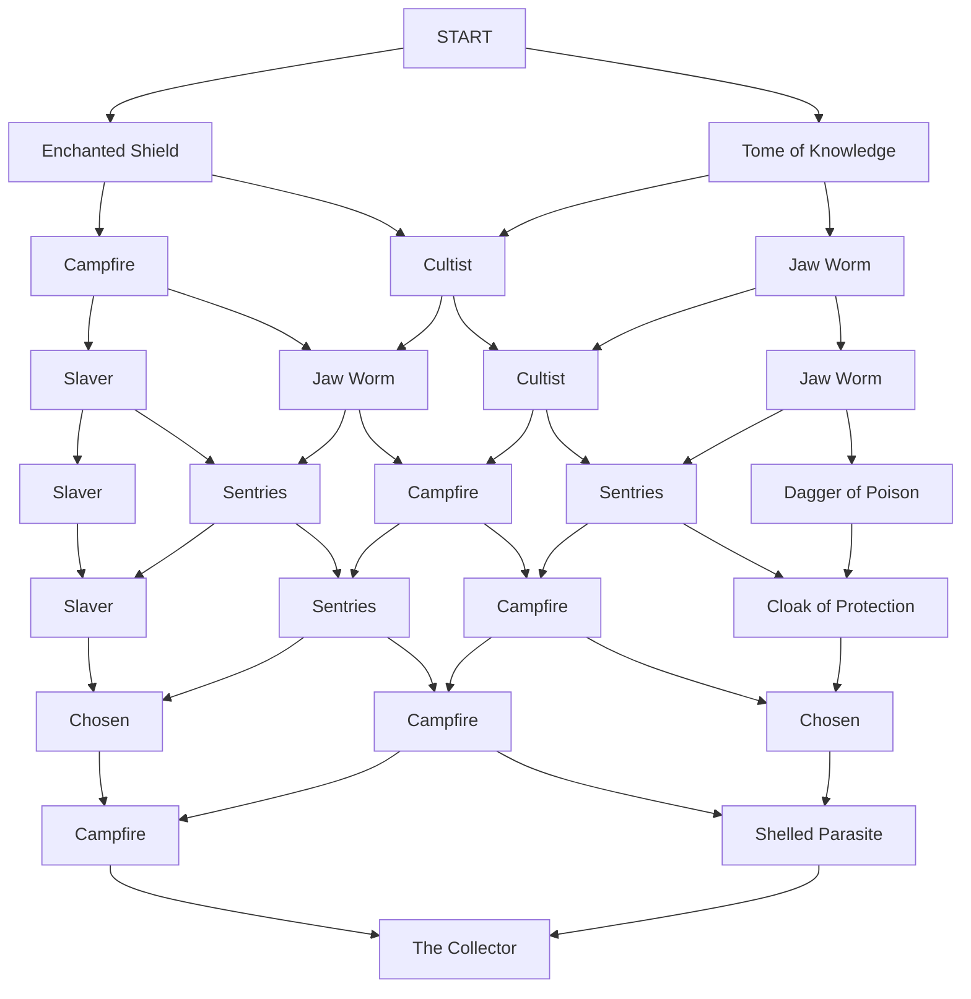
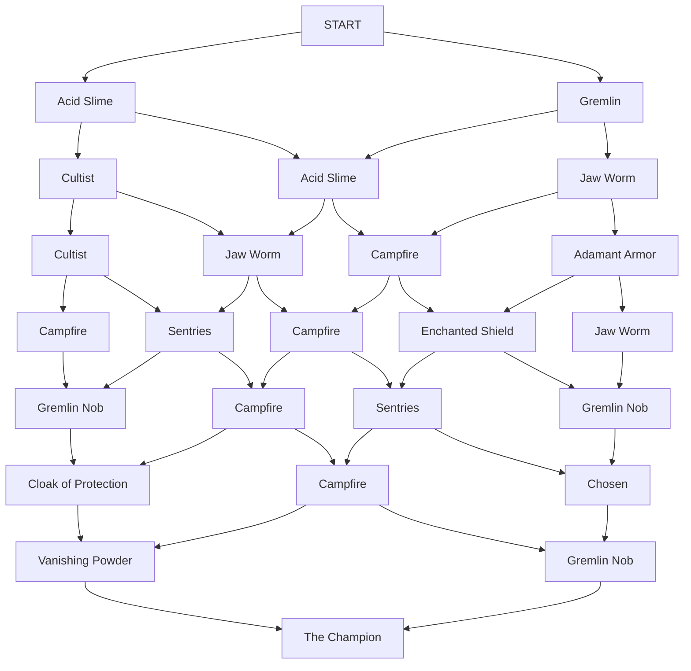

This is an entry in the 'Dungeons & Data Science' series, a set of puzzles where players are given a dataset to analyze and an objective to pursue using information from that dataset.

Estimated Complexity Rating: 3.5/5

# STORY[^1]

The Tower is a plague upon the lands!  It appears, spits out monsters, and when at length a brave hero manages to Topple it, why, it simply reappears elsewhere soon after, with a completely different layout so the same approach will not work again!

But now you are here.  With the power of Data Science on your side, you've secured a dataset of the many past heroes who have assaulted The Tower, and you're sure you can use that to advise those who seek to Topple it.

# DATA & OBJECTIVES

Here is the layout of paths through the current appearance of The Tower:



You need to successfully Topple The Tower.

To do this, you must choose a Class of hero to send: Mage, Rogue, or Warrior.

You must also choose a route for them to take up The Tower.  They must work their way through it, choosing to go left or right at each level.

For example, you could send a Mage with instructions to stick to the left side.  They would encounter, in order:

```
START
Enchanted Shield
Campfire
Slaver
Slaver
Slaver
Chosen
Campfire
The Collector
```

To help with this, you have a dataset of past assaults on The Tower.  Each row is a Hero who assailed The Tower, what encounters they faced on each floor, and how far they got/whether they Toppled The Tower successfully.

# BONUS OBJECTIVE (ASCENSION 20?)

As a bonus objective, you can attempt to Topple a more difficult Tower.  This uses the same ruleset as before, you get to select your character and path as before, but you need to defeat the following map instead:



Good luck!

# SCHEDULING & COMMENTS

I'll aim to post the ruleset and results on March 16th, but given my extremely poor excellent decision-making skills in releasing my Slay-the-Spire-themed game the same week as Slay the Spire 2 comes out, please don't hesitate to ask for an extension/several extensions if you want them!  Update: March 23rd per extension request.

As usual, working together is allowed, but for the sake of anyone who wants to work alone, please spoiler parts of your answers  that contain information or questions about the dataset.  To spoiler answers on a PC, type a '>' followed by a '!' at the start of a line to open a spoiler block - to spoiler answers on mobile, type a ':::spoiler' at the start of a line and then a ':::' at the end to spoiler the line.

Now if you'll excuse me, I need to go play Slay the Spire 2 for the next 48 hours.

[^1]: Really?  Does Slay the Spire even HAVE lore?  If it does, I don't know it.
